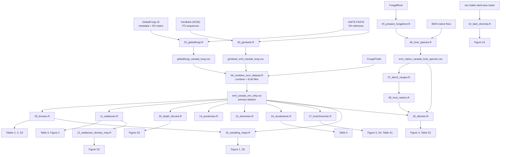

# Background

This repo houses the reproducible analysis pipeline and manuscript sources for *An assessment of biodiversity data shortfalls for ectomycorrhizal fungi in Canada*.

**Manuscript authors**: Isaac Eckert, Clara Qin, Stephanie Kivlin, Bronte Shelton, Diego Yusta Belsham, Monika Fischer, Justine Karst, and Jason Pither

**Script authors**: Jason Pither and Claude (Sonnet 4.6, 5, Opus 4.8)

**Citation**: This will be provided once (i) a manuscript preprint has been submitted and (ii) we have a DOI for the data and code archive.

**Contacts**:
- Jason Pither — jason.pither@ubc.ca | ORCID: https://orcid.org/0000-0002-7490-6839 | Irving K. Barber Faculty of Science, The University of British Columbia, Kelowna, BC, Canada

The pipeline quantifies the seven Hortal et al. (2015) biodiversity shortfalls
(Linnean, Wallacean, Prestonian, Darwinian, Raunkiæran, Hutchinsonian, Eltonian)
for ectomycorrhizal (EcM) fungi in Canada, using publicly accessible sequence
data from **GlobalFungi v5** and **NCBI GenBank**, cross-referenced with UNITE,
FungalTraits, FungalRoot, BIEN/BIEN2, MycoCosm, BioTIME, WorldClim, and the van
Galen et al. (2025) dark-taxa dataset.

## Quick start

**NOTE**: This repo holds code, manuscript sources and figures. It does not
hold the raw inputs (~16 GB) or the derived data (~1.4 GB); those live in the
Borealis archive (see Archiving below). The pipeline regenerates every derived
file from the raw inputs.

```r
# 1. From the project root (where ECM_manuscript.Rproj lives):
#    place the raw inputs in data_raw/ (see data_raw/DATA-DICTIONARY.md).

# 2. Run the full pipeline in order (each script is checkpoint-guarded):
source(here::here("scripts", "run_all.R"))
#    (set ECM_SKIP_HEAVY=true to skip the two ~13 GB global-matrix steps)
```

This regenerates every file in `data_derived/` and `figures/` from the raw
inputs. The manuscript (`FACETS/manuscript_FACETS_final.qmd`) and Supplemental
Materials documents (`FACETS/supplemental_materials_SM1_FACETS.qmd`,
`FACETS/supplemental_materials_SM2_FACETS.qmd`)
read from these `data_derived/` outputs to report in-text statistics and
supplemental tables/figures. Rendering them therefore requires either running
the pipeline first or obtaining `data_derived/` from the Borealis archive.

See `scripts/README.md` for the per-script inputs, outputs, and the manuscript
items each script supports.

### Pipeline workflow



## Prerequisites

### Software

- **R** (developed under v4.5.2).
- **[Quarto](https://quarto.org)** — only needed to render the manuscript or
  Supplemental Materials documents; not required to run the `scripts/` pipeline.
- **`ITSx`** (≥ 1.1; developed under v1.1.3) — required by `03_genbank.R` to detect and extract the
  ITS1/ITS2 sub-regions from GenBank sequences. Download from
  <https://microbiology.se/software/itsx/> and put the `ITSx` script *and its
  bundled HMM-profile directory* on `PATH`.
- **`HMMER`** (3.x) — ITSx's backend; ITSx will not run without it.
  `brew install hmmer` (macOS) / `sudo apt install hmmer` (Ubuntu).
- **`vsearch`** (≥ 2.x) — required by `03_genbank.R` for SH assignment.
  `brew install vsearch` (macOS) / `sudo apt install vsearch` (Ubuntu).
- **`awk`** — used by a shared helper in `00_setup.R` and by
  `02_globalfungi.R`, `12_wallacean_density_map.R` and
  `13_wallacean_global_comparator.R` to subset the multi-gigabyte GlobalFungi
  matrices without loading them into R. Standard on macOS and Linux.

### R packages (managed with `renv`)

R package dependencies are managed with [`renv`](https://rstudio.github.io/renv/),
which records exact package versions in `renv.lock` for a reproducible library.

**First-time setup in this project** (creates `renv.lock` and the private
library from the currently installed packages):

```r
install.packages("renv")   # if not already installed
renv::init()               # then renv::snapshot() to record versions
```

**Restoring the library on another machine** (once `renv.lock` exists):

```r
install.packages("renv")   # if not already installed
renv::restore()
```

The same `renv::restore()` command works on macOS, Linux, and Windows. Packages
with compiled code may need a compiler toolchain:

> **macOS**: Xcode command line tools (`xcode-select --install`).
> **Windows**: matching [Rtools](https://cran.r-project.org/bin/windows/Rtools/)
> for your R version.

The packages the pipeline uses (captured by `renv` on the first snapshot):

```r
# core:        here, dplyr, tidyr, readr, purrr, tibble
# spatial:     sf, terra, tidyterra, geodata, rnaturalearth, foreign
# figures:     ggplot2, patchwork, scales, colorspace
# acquisition: rentrez, rgbif, BIEN, NSR, GIFT, httr, readxl
# misc:        data.table, usethis
# rendering:   knitr (manuscript/supplements only)
```

### API keys

Some acquisition steps call external services. Store keys in `~/.Renviron`
(which must be git-ignored, never committed).

| Key | Service | How to obtain | Needed for |
|---|---|---|---|
| `ENTREZ_KEY` | NCBI / Entrez | register at ncbi.nlm.nih.gov | `03_genbank.R`, `18_eltonian.R` (recommended; raises the rate limit) |
| `GBIF_USER`, `GBIF_PWD`, `GBIF_EMAIL` | GBIF downloads | register at gbif.org | `09_linnean.R` — **only** if the provided GBIF specimen ZIP in `data_raw/gbif/` is absent |

`07_bien2_ranges.R` (biendata.org) and `06_host_species.R` (BIEN) require
internet access but no key.

## Project structure

```
ECM_manuscript/
├── README.md                     # this file
├── ECM_manuscript.Rproj          # RStudio project root (anchors here::here())
├── renv.lock                     # renv: pinned package versions (created by renv::init)
├── renv/                         # renv: private project library + settings
├── scripts/
│   ├── 00_setup.R                # shared paths, helpers, constants (sourced everywhere)
│   ├── 01_…_20_….R               # ordered pipeline (see scripts/README.md)
│   ├── run_all.R                 # master runner (sources 01–20 in order)
│   └── README.md                 # per-script inputs/outputs
├── data_raw/                     # READ-ONLY external inputs — NOT in this repo
│   └── DATA-DICTIONARY.md        #   (the dictionary IS tracked: how to obtain each input)
├── data_derived/                 # pipeline outputs — NOT in this repo
│   └── DATA-DICTIONARY.md        #   (the dictionary IS tracked)
├── figures/                      # tracked, except the high-resolution .tif versions
├── repro/                        # reproducibility baseline (99_verify_reproducibility.R)
└── FACETS/                       # manuscript + Supplemental Materials sources
    ├── manuscript_FACETS_final.qmd
    ├── supplemental_materials_SM1_FACETS.qmd
    ├── supplemental_materials_SM2_FACETS.qmd
    ├── references.bib            # shared bibliography
    └── facets.csl                # FACETS citation style
```

What is deliberately **not** in this repo: `data_raw/` and `data_derived/`
contents (volume), and the high-resolution `.tif` figure versions required by
FACETS (~332 MB, regenerable). Both data directories keep their
`DATA-DICTIONARY.md` so every input and output stays documented without being
stored here.

## Key outputs

| Manuscript item | File | Produced by |
|---|---|---|
| Figure 1 | `figures/Figure-01_sampling_map.png` (+ grey variant, see below) | `19_sampling_maps.R` |
| Figure 2 | `figures/Figure-02_wallacean_occupancy.png` | `11_wallacean.R` |
| Figure 3 | `figures/Figure-03_climate_gap.png` (+ grey variant, see below) | `17_hutchinsonian.R` |
| Figure 4 | `figures/Figure-04_host_bivariate_map.png` (+ grey variant, see below) | `18_eltonian.R` |
| Figure 5 | `figures/Figure-05_shortfalls_summary.png` — hand-assembled schematic, not scripted (see below) | manual |
| Figure S1 | `figures/Figure-S1_dark_diversity.png` (+ grey variant, see below) | `10_dark_diversity.R` |
| Figure S2 | `figures/Figure-S2_gf_sampling_density_world.png` | `12_wallacean_density_map.R` |
| Figure S3 | `figures/Figure-S3_depth_discard.png` | `20_depth_discard.R` |
| Figure S4 | `figures/Figure-S4_ecozone_sampling_map.png` (+ grey variant, see below) | `17_hutchinsonian.R` |
| Figure S5 | `figures/Figure-S5_gbif_specimens.png` (+ grey variant, see below) | `19_sampling_maps.R` |
| Tables 1–4 | `data_derived/` CSVs, rendered into tables by `FACETS/manuscript_FACETS_final.qmd` | 09, 11, 16, 18 |
| Tables S1–S4 | `data_derived/` CSVs, rendered into tables by `FACETS/supplemental_materials_SM1_FACETS.qmd` | 09, 17, 18 |

Figure 5 is a manually assembled schematic composite built from panels taken
from Figures 1, 3, 4, S1, S4, and S5. To support that, scripts `10`, `17`,
`18`, and `19` each save a second, `_grey`-suffixed copy of their figure(s) on
a `#F2F2F2` background (e.g. `Figure-03_climate_gap_grey.png`), alongside the
normal white-background copy used in the manuscript/SI. Both land in
`figures/`; only the white versions are referenced by the manuscript and the
Supplemental Materials documents.

## Documentation

| Document | Contents |
|---|---|
| `scripts/README.md` | Pipeline order, per-script inputs/outputs, external tools |
| `data_raw/DATA-DICTIONARY.md` | Every raw input: source, DOI, filters, sizes |
| `data_derived/DATA-DICTIONARY.md` | Every generated file and its producing script |
| `FACETS/manuscript_FACETS_final.qmd` | Manuscript source |
| `FACETS/supplemental_materials_SM1_FACETS.qmd` | SM1: detailed methods |
| `FACETS/supplemental_materials_SM2_FACETS.qmd` | SM2: decisions log |
| `scripts/99_verify_reproducibility.R` | Fingerprints outputs and verifies a rerun reproduces them |
| `ARCHIVING.md` | Borealis deposit plan: what is archived, licences, checklist |

## Archiving

This GitHub repository is the working home for the code and manuscript
sources. The **Borealis** deposit (UBC's Dataverse instance) is the citable
archive of record, with a minted DOI.

| Component | GitHub | Borealis |
|---|---|---|
| `scripts/`, `FACETS/` sources | ✅ tracked | ✅ snapshot at submission |
| `figures/` (PNG, JPG) | ✅ tracked | ✅ |
| `figures/` (TIF, ~332 MB) | ❌ regenerable | ✅ |
| `data_derived/` (~1.4 GB) | ❌ volume | ✅ |
| `data_raw/` (~16 GB) | ❌ volume | ⚠️ selectively — see below |

The full plan, including the deposit structure and checklist, is in
[`ARCHIVING.md`](ARCHIVING.md).

**Raw inputs are cited, not copied.** Most source datasets are published,
versioned and retrievable by DOI or a stable versioned URL, so the archive
records exactly how to obtain each one rather than duplicating it. Every entry
in `data_raw/DATA-DICTIONARY.md` carries the source, version and access date
needed to rebuild `data_raw/` from scratch.

Two categories are exceptions and **are** deposited, because citation alone
does not make them retrievable:

- **The GBIF occurrence download.** GBIF deletes download files six months
  after creation; the DOI then resolves to a record of the query, not the
  data. Re-running the query later returns a different result set.
- **Live-query snapshots** (`data_derived/checkpoints/`) from BIEN, NSR, GIFT,
  MycoCosm and GenBank. These query moving targets with no versioning, so the
  exact result cannot be re-obtained.

## How to cite

> [Journal / year — TODO: update on acceptance.]

For the code and data archive, cite the Borealis deposit DOI once minted
(`[TODO: add Borealis DOI]`).

## Licence

Code and data are licensed separately, as they are different kinds of work:

| Component | Licence |
|---|---|
| **Code** — `scripts/`, `FACETS/` sources | [MIT](LICENSE) |
| **Derived data** — `data_derived/`, `figures/` | [CC BY-NC 4.0](https://creativecommons.org/licenses/by-nc/4.0/) |

The NonCommercial condition on the data is inherited from two inputs
(FungalRoot and our GBIF occurrence download, both CC BY-NC 4.0); products
derived from them cannot be released more permissively. CC0 is therefore not
available for this deposit. No input imposes a NoDerivatives or ShareAlike
term.

Per-source terms for all 20 inputs are tabulated in
`data_raw/DATA-DICTIONARY.md` > Licence summary. Two sources — GADM and
WorldClim — prohibit redistribution entirely, and four state no licence at all;
see [`ARCHIVING.md`](ARCHIVING.md) for how the deposit handles both cases.

## References

Hortal J et al. (2015) Seven shortfalls that beset large-scale knowledge of
biodiversity. *Annual Review of Ecology, Evolution, and Systematics* 46:
523–549.

Full dataset citations are listed in `data_raw/DATA-DICTIONARY.md` and the
References section of the manuscript and Supplemental Materials.
