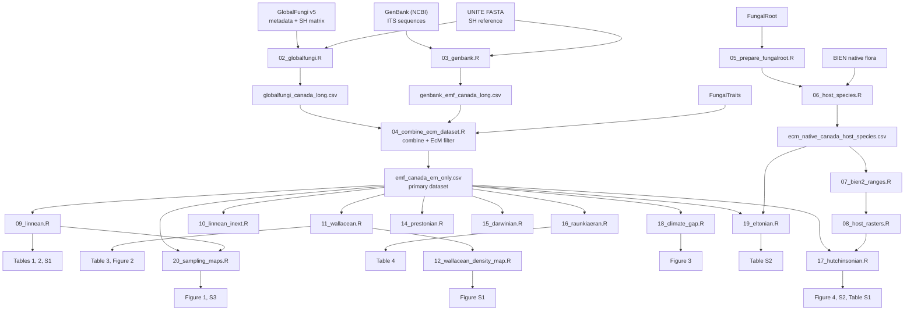

# Background

This repo houses code and Supplemental Materials for the manuscript *An assessment of biodiversity data shortfalls for ectomycorrhizal fungi in Canada*

**Manuscript authors**: Isaac Eckert, Clara Qin, Stephanie Kivlin, Bronte Shelton, Diego Yusta Belsham, Monika Fischer, Justine Karst, and Jason Pither

**Script authors**: Jason Pither with substantive help from Claude

**Citation**: This will be provided once (i) a manuscript preprint has been submitted and (ii) we have a DOI for the data and code archive.

**Contacts**:
- Jason Pither — jason.pither@ubc.ca | ORCID: https://orcid.org/0000-0002-7490-6839 | Irving K. Barber Faculty of Science, The University of British Columbia, Kelowna, BC, Canada

The pipeline quantifies the seven Hortal et al. (2015) biodiversity shortfalls
(Linnean, Wallacean, Prestonian, Darwinian, Raunkiæran, Hutchinsonian, Eltonian)
for ectomycorrhizal (EcM) fungi in Canada, using publicly accessible sequence
data from **GlobalFungi v5** and **NCBI GenBank**, cross-referenced with UNITE,
FungalTraits, FungalRoot, BIEN/BIEN2, MycoCosm, BioTIME, WorldClim, and the van
Galen et al. (2025) dark-taxa dataset.

## Quick start

**NOTE**: Raw data files are not stored on this repo. They will be archived (subject to copyright) at an appropriate data repository. 

```r
# 1. From the project root (where ECM_manuscript.Rproj lives):
#    place the raw inputs in data_raw/ (see data_raw/DATA-DICTIONARY.md).

# 2. Run the full pipeline in order (each script is checkpoint-guarded):
source(here::here("scripts", "run_all.R"))
#    (set ECM_SKIP_HEAVY=true to skip the two ~13 GB global-matrix steps)

# 3. Render the Supplemental Materials:
quarto::quarto_render(here::here("supplemental_materials.qmd"))
```

See `scripts/README.md` for the per-script inputs, outputs, and the manuscript
items each script supports.

### Pipeline workflow



## Prerequisites

### Software

- **R** (developed under v4.5.2).
- **[Quarto](https://quarto.org)** to render `supplemental_materials.qmd`.
- **`vsearch`** (≥ 2.x) — required by `03_genbank.R` for SH assignment.
- **`awk`** — required by `02_globalfungi.R` to subset the ~13 GB GlobalFungi
  matrix.

### R packages (managed with `renv`)

R package dependencies are managed with [`renv`](https://rstudio.github.io/renv/),
which records exact package versions in `renv.lock` for a reproducible library.

**First-time setup in this project** (creates `renv.lock` and the private
library from the currently installed packages):

```r
install.packages("renv")   # if not already installed
renv::init()               # then renv::snapshot() to record versions
```

**Restoring the library on another machine** (once `renv.lock` exists):

```r
install.packages("renv")   # if not already installed
renv::restore()
```

The same `renv::restore()` command works on macOS, Linux, and Windows. Packages
with compiled code may need a compiler toolchain:

> **macOS**: Xcode command line tools (`xcode-select --install`).
> **Windows**: matching [Rtools](https://cran.r-project.org/bin/windows/Rtools/)
> for your R version.

The packages the pipeline uses (captured by `renv` on the first snapshot):

```r
# core:        here, dplyr, tidyr, readr, ggplot2, tibble
# spatial:     sf, terra, geodata, rnaturalearth, rmapshaper, foreign
# community:   vegan, iNEXT
# acquisition: rentrez, rgbif, BIEN, httr
# misc:        patchwork, scales, knitr, data.table
```

### API keys

Some acquisition steps call external services. Store keys in `~/.Renviron`
(which must be git-ignored, never committed).

| Key | Service | How to obtain | Needed for |
|---|---|---|---|
| `ENTREZ_KEY` | NCBI / Entrez | register at ncbi.nlm.nih.gov | `03_genbank.R`, `19_eltonian.R` (recommended; raises the rate limit) |
| `GBIF_USER`, `GBIF_PWD`, `GBIF_EMAIL` | GBIF downloads | register at gbif.org | `09_linnean.R` — **only** if the provided GBIF specimen ZIP in `data_raw/gbif/` is absent |

`07_bien2_ranges.R` (biendata.org) and `06_host_species.R` (BIEN) require
internet access but no key.

## Project structure

```
ECM_manuscript/
├── README.md                     # this file
├── ECM_manuscript.Rproj          # RStudio project root (anchors here::here())
├── renv.lock                     # renv: pinned package versions (created by renv::init)
├── renv/                         # renv: private project library + settings
├── supplemental_materials.qmd    # Supplemental Materials (methods + tables/figures)
├── scripts/
│   ├── 00_setup.R                # shared paths, helpers, constants (sourced everywhere)
│   ├── 01_…_20_….R               # ordered pipeline (see scripts/README.md)
│   ├── run_all.R                 # master runner (sources 01–20 in order)
│   └── README.md                 # per-script inputs/outputs
├── data_raw/                     # READ-ONLY external inputs (see its DATA-DICTIONARY.md)
├── data_derived/                 # pipeline outputs — starts EMPTY, regenerated
└── figures/                      # figures — starts EMPTY, regenerated (Figure-xx_*.png)
```

## Key outputs

| Manuscript item | File | Produced by |
|---|---|---|
| Figure 1 | `figures/Figure-01_sampling_map.png` | `20_sampling_maps.R` |
| Figure 2 | `figures/Figure-02_wallacean_occupancy.png` | `11_wallacean.R` |
| Figure 3 | `figures/Figure-03_climate_gap.png` | `18_climate_gap.R` |
| Figure 4 | `figures/Figure-04_host_bivariate_map.png` | `17_hutchinsonian.R` |
| Figure S1 | `figures/Figure-S1_gf_sampling_density_world.png` | `12_wallacean_density_map.R` |
| Figure S2 | `figures/Figure-S2_ecozone_sampling_map.png` | `17_hutchinsonian.R` |
| Figure S3 | `figures/Figure-S3_gbif_specimens.png` | `20_sampling_maps.R` |
| Tables 1–4, S1, S2 | via `supplemental_materials.qmd` / `data_derived/` CSVs | 09, 11, 16, 17, 19 |

## Documentation

| Document | Contents |
|---|---|
| `scripts/README.md` | Pipeline order, per-script inputs/outputs, external tools |
| `data_raw/DATA-DICTIONARY.md` | Every raw input: source, DOI, filters, sizes |
| `data_derived/DATA-DICTIONARY.md` | Every generated file and its producing script |
| `supplemental_materials.qmd` | Full Supplemental Methods + supplemental tables/figures |

## How to cite

> [Journal / year — TODO: update on acceptance.]

For the code and data archive, cite the repository release DOI once minted
(`[TODO: add archive DOI]`).

## License

- **Code** (`scripts/`, `supplemental_materials.qmd`): MIT License.
- **Derived data** (`data_derived/`): CC BY-NC 4.0, subject to the terms of the
  upstream source databases.

## References

Hortal J et al. (2015) Seven shortfalls that beset large-scale knowledge of
biodiversity. *Annual Review of Ecology, Evolution, and Systematics* 46:
523–549.

Full dataset citations are listed in `data_raw/DATA-DICTIONARY.md` and the
References section of `supplemental_materials.qmd`.
